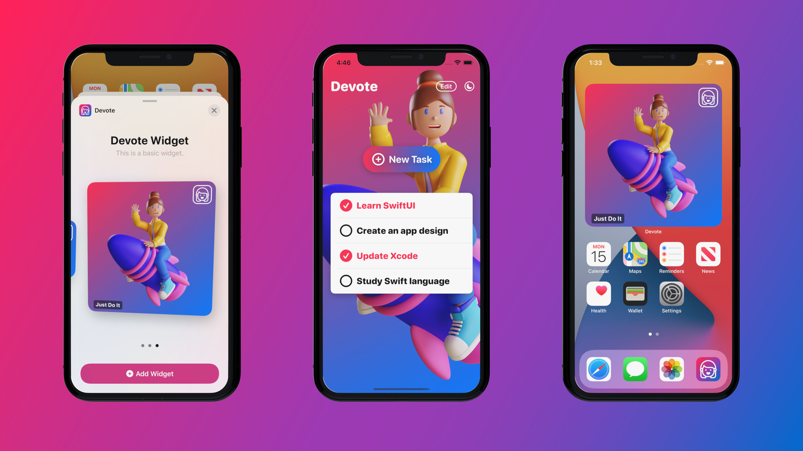

# SwiftUI 2 - Devote
 

  

  In this SwiftUI tutorial, we will develop a task manager iOS application with Core Data integration. This is not a project with a boring user interface. This iOS and iPadOS application provides a personal touch and feel.

### Learn how to integrate Core Data with SwiftUI

Apple's Core Data framework helps developers to manage and interact with data on a persistent store. It works on iPhone, iPad, Mac computer, or even Apple Watch.

When we start from a brand new project, the easiest way to use the Core Data framework is by enabling the Core Data option on the setup screen. By doing that Xcode will generate all the required file templates with code and the managed object model for us.

This Xcode 12's new Core Data template comes with the SwiftUI app life cycle integration and the required Core Data Model. This is why it is worth knowing how to get started with this new template and how to create a working application.

  

## Topics are covered:

- [x] How to integrate Core Data with the SwiftUI App Life Cycle
- [x] How to get familiar with Xcode's new Core Data template
- [x] How to create a basic Widget for iOS and iPadOS devices
- [x] How to develop a Widget sets with different sizes (small, medium, large)
- [x] How to set up the Preview to test the different Widget sizes on the Canvas
- [x] How to Create, Read, Update and Delete a database item (CRUD method)
- [x] How to show SwiftUI views conditionally
- [x] How to switch from Light mode to Dark mode the app's appearance
- [x] How to store the app's appearance using App Storage
- [x] How to create a visual effect with SwiftUI (blur, overlay, display mode)
- [x] How to add the required assets for the Widget extension
- [x] How to develop a custom Toggle style and make a checkbox
- [x] How to improve the User Experience with sound effects
- [x] Practice how to use Apple's Feedback Generator and implement haptics

## Demo

  
  

    App icon
  

  
  

    Core Data application
  

  
  

    iOS 14 Widgets
  

  
  

    Text field and custom visual effect
  

  
  

    App appearance toggle (Light and Dark mode)
  

  
  

    Launch Screen
  

## Meta

Tin Tran – [Linkedin](https://www.linkedin.com/in/realtrantrungtin) – realtrantrungtin@gmail.com
